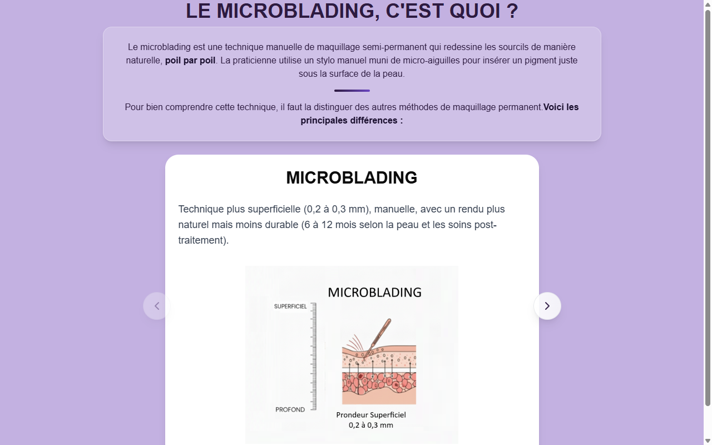

# Technique Partagée — Microblading / Microblading EN / Microblading+Microshading Slide 3

**Course:** MICROBLADING / MICROBLADING (EN) / MICROBLADING + MICROSHADING  
**Slide:** 3  
**Live URL:** https://slidea.edtechiecorp.com  
**Stack:** Next.js · Tailwind CSS · TypeScript · GitHub Pages  

## What this slide does

Shared technique slide used across all three microblading-related courses — the French course, the English course, and the combined microblading and microshading course. At slide 3, learners receive their first look at the core technique content: tool handling, pigment preparation, and the foundational strokes that underpin all microblading work. The shared nature of this asset ensures consistent technique instruction across language variants.

## Screenshot

## Usage

This slide is embedded as an iframe inside Coassemble at the live URL above. DNS is managed via Cloudflare (`edtechiecorp.com`). To update the slide, push to the `main` branch — GitHub Actions will rebuild and redeploy automatically.
